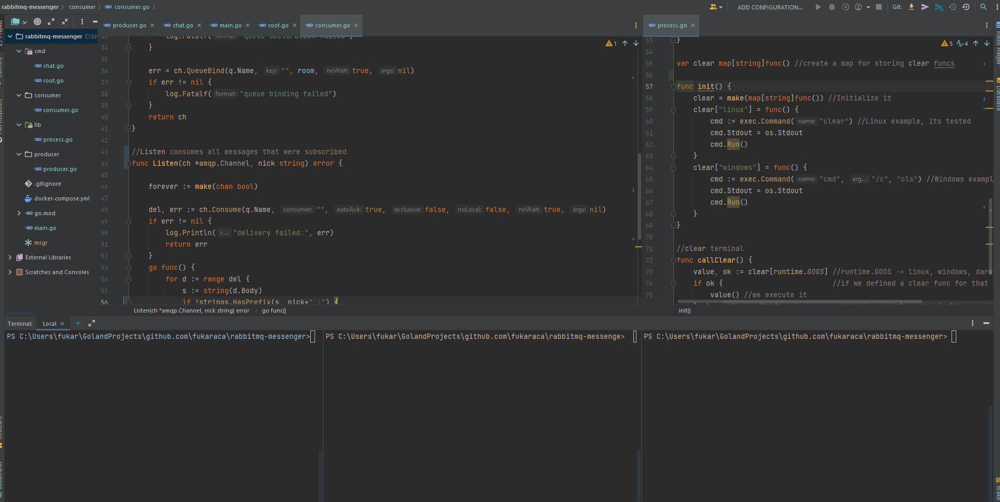

# RabbitMQ-messenger

A simple messenger application over CLI with the help of RabbitMQ pub/sub model. 




```
git clone https://github.com/fukaraca/rabbitmq-messenger.git
```
After a running RabbitMQ image you can either install the built app to Go/bin or simply run directly from project folder.

Usage is (lets say binary was named as msgr):
```
msgr chat --room "Room of Requirements" --nickname "Harry Potter"
```